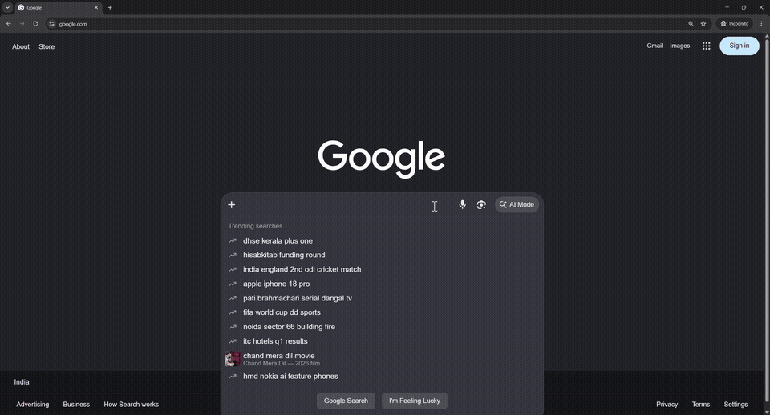
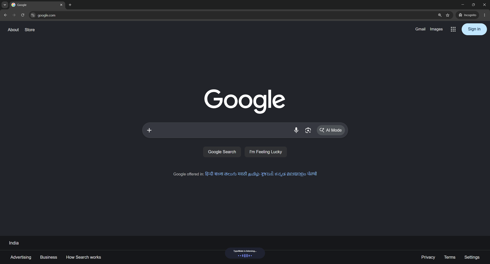
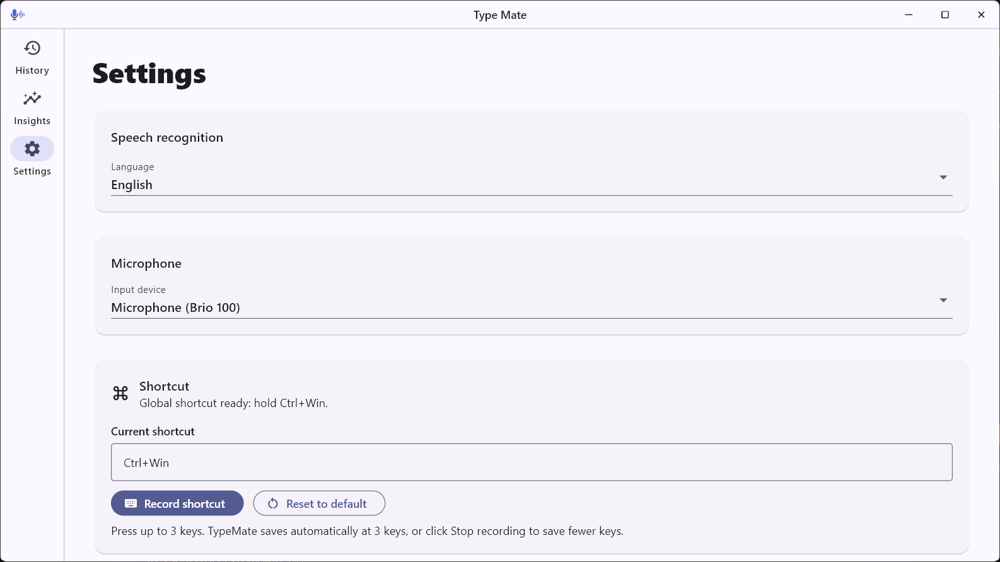
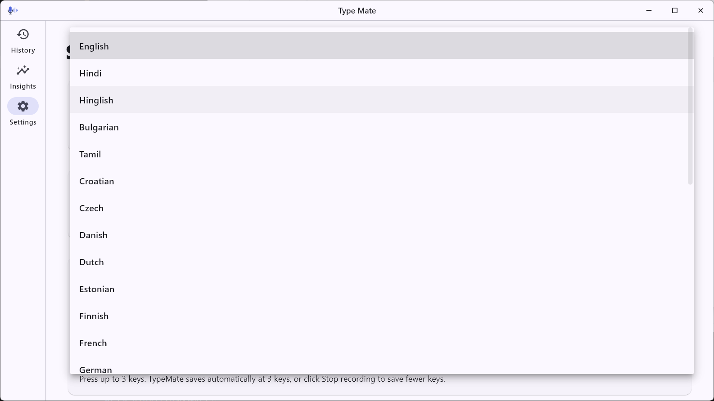
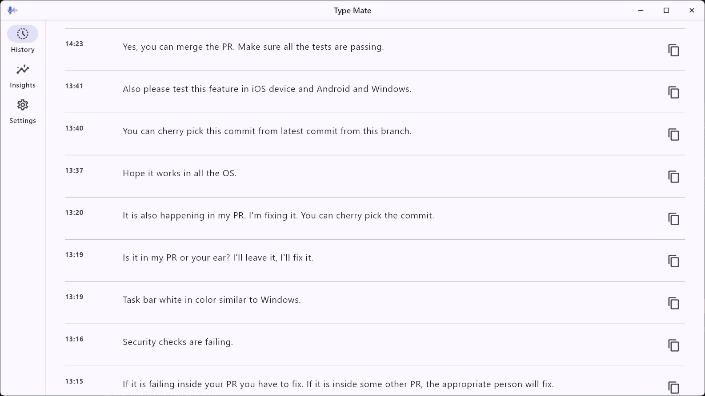
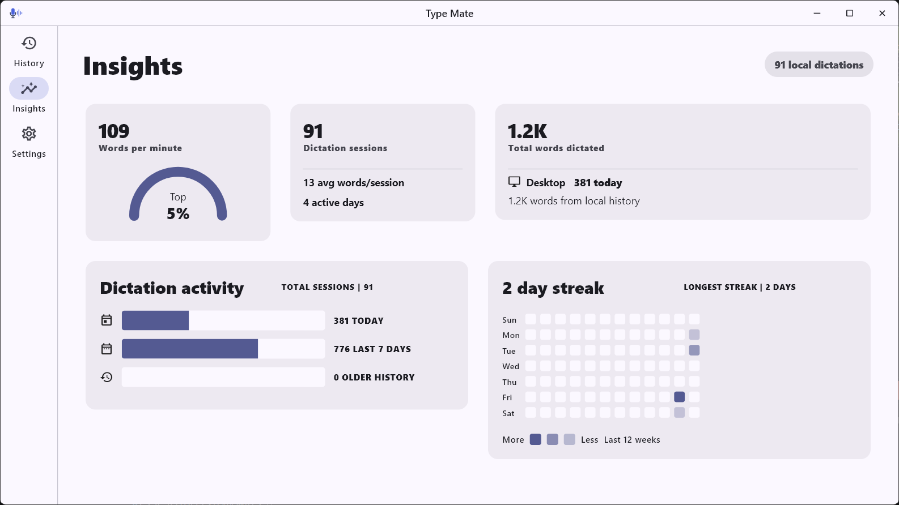
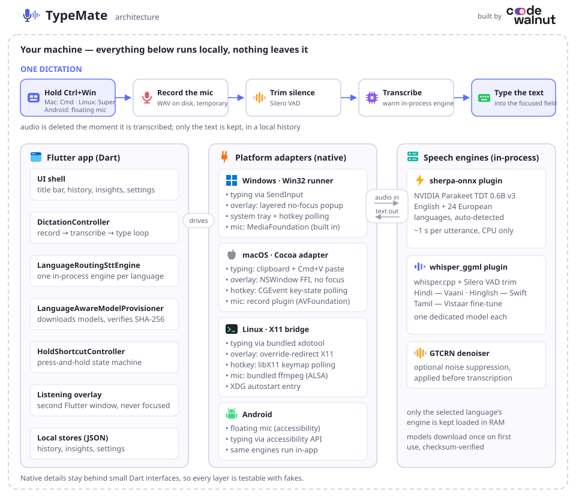

# TypeMate

**Hold a key. Speak. Your words are typed into whatever app you're using.**

TypeMate is a dictation app for **Windows, Linux, and Android** that runs **100% locally** — every word you speak is transcribed by AI models running on your own machine. No cloud, no account, no subscription, and no audio ever leaves your device.



*Dictating straight into Chrome — hold **Ctrl+Win**, speak, release. ([full-quality video](https://github.com/Ranjan-Bhagat/typemate/releases/download/v1.0.0/TypeMate-demo.mp4))*

## Why TypeMate?

- **Your voice stays on your machine.** Cloud dictation tools stream your microphone to someone else's servers. TypeMate downloads your language's speech model once, then transcribes entirely on-device — it works with Wi-Fi off. Dictation audio is deleted the instant it's transcribed — only the text is kept, in a local history you can clear.
- **It types where you're looking.** No copy-paste, no separate window. Whatever field has focus — a code editor, a browser, a chat box, an AI agent prompt — the transcript is typed there directly, like a keyboard.
- **It's fast enough to replace typing.** English transcribes in about a second per utterance on an ordinary laptop CPU (no GPU needed). Speaking is 3–4× faster than typing for most people; for long prompts to AI agents it's dramatically less tiring.
- **It speaks your languages.** 29 languages, including Hindi, **Hinglish** (Hindi speech written in romanized form — the way people actually text), and Tamil — each backed by a model we validated for accuracy and speed before shipping.
- **It stays out of the way.** Lives in the system tray, starts with Windows if you want, and does nothing until you hold the shortcut.

## See it



*Works in any app — the pill at the bottom shows TypeMate listening while the shortcut is held.*



*One page of settings: language, microphone, shortcut. No accounts, no cloud toggles.*



*29 languages, every one backed by a locally validated model.*



*Every dictation lands in a local-only history you can copy from or clear.*



*A usage dashboard — words per minute, streaks, activity — computed entirely from your local history.*

## Install (Windows)

1. Download the **`TypeMate-Setup-*.exe`** installer from the [latest release](https://github.com/CW-Codewalnut/typemate/releases/latest) and run it.
2. Launch **Type Mate** from the Start menu.
3. Pick your microphone in Settings, focus any text field, hold **Ctrl+Win**, and speak.

Installers are small (~35 MB): the app downloads your selected language's speech model once on first use (English is ~640 MB), verifies it, and never needs the network for dictation again. Prefer a portable app? Each release also ships a `TypeMate-*-windows-x64.zip` — extract anywhere and run `typemate.exe`.

> **SmartScreen note:** the installer is not yet code-signed, so Windows may show "Windows protected your PC" — click *More info → Run anyway*.

## Install (Linux, X11)

1. Download the `.deb` (Debian/Ubuntu), `.rpm` (Fedora), or portable `TypeMate-*-linux-x64.tar.gz` from the [latest release](https://github.com/CW-Codewalnut/typemate/releases/latest).
2. Install it (or just extract the tarball and run `./TypeMate/typemate`), hold **Ctrl+Super**, and speak.

The capture and typing tools are bundled — no packages to install; your language's speech model downloads once on first use. Recording uses the system-default microphone (change it in your desktop's sound settings).

Linux support targets **X11 sessions** (or apps running under XWayland). Pure Wayland blocks global shortcuts and synthetic typing by design — support for the Wayland portal APIs is planned.

## Install (Android)

1. Download the **`TypeMate-*-android.apk`** from the [latest release](https://github.com/CW-Codewalnut/typemate/releases/latest) and open it on your phone (allow installing from unknown sources when prompted — the preview APK is not yet Play-signed).
2. Open TypeMate, pick your language, and download its speech model when offered.
3. Dictate in the app with the hold-to-talk mic, or enable the **floating mic** (an accessibility overlay) to dictate into any app — the transcript is typed into the focused field, and the same in-app languages, noise suppression, and history all apply.

## How it works



One dictation, end to end:

```
you hold Ctrl+Win
   └─ your selected microphone records to a WAV
you release
   └─ Silero VAD trims the silence around your speech
   └─ the speech engine for your language transcribes it in-process
        (the model is already loaded in RAM, so there is no model-load wait)
   └─ the transcript is typed into the focused field via the Windows
        SendInput API — exactly as if you had typed it
   └─ the WAV is deleted; the text is saved to your local history
```

The key design decision is the **resident in-process engine**. Loading a speech model from disk takes far longer than actually transcribing a few seconds of audio, so TypeMate loads your selected language's model inside the app when it opens and keeps it warm in memory — no helper processes, no ports. Each dictation then only pays for the transcription itself:

| Language | Model | Typical latency* |
|---|---|---|
| English + 24 European languages | NVIDIA Parakeet TDT 0.6B v3 (int8) | ~1s |
| Hindi | Vaani whisper fine-tune (noise-robust Devanagari) | ~5s |
| Hinglish | Oriserve Swift whisper fine-tune (romanized output) | ~1.5s |
| Tamil | AI4Bharat Vistaar whisper fine-tune | ~6-11s |

*\*per ~13s utterance on a mid-range laptop CPU (i5-11300H), no GPU; scales with clip length.*

To keep memory honest, **only the selected language's engine stays loaded** — switching languages releases the old model and warms the new one up in the background, so RAM isn't wasted on models you aren't using.

## How it's made

- **App shell:** [Flutter](https://flutter.dev) — one codebase for the Windows, Linux, and Android apps, with the platform-specific pieces (global hold-shortcut polling, system tray, focused-field text insertion, listening/error overlays, Android's accessibility floating mic) written natively per platform and hidden behind small Dart interfaces so everything is testable with fakes.
- **English + European speech:** the [sherpa-onnx](https://github.com/k2-fsa/sherpa-onnx) plugin running NVIDIA's Parakeet TDT 0.6B v3 in-process — the most accurate model we benchmarked at any size for Indian-accented English, with automatic language detection across its 25 languages and native punctuation.
- **Indian-language speech:** [whisper.cpp](https://github.com/ggml-org/whisper.cpp) in-process via the [whisper_ggml](https://github.com/sk3llo/whisper_ggml) plugin (our fork adds a resident-model cache and Silero VAD, offered upstream), running community fine-tunes of OpenAI's Whisper, one dedicated model per language. Audio is pre-trimmed with Silero voice-activity detection (without it, Whisper hallucinates and repeats sentences while decoding silence).
- **Model curation:** every language in the picker earned its place on a persistent benchmark corpus (`test_assets/stt_benchmark/` — identical audio clips with expected transcripts, replayed against every candidate model). Models that hallucinated, corrupted output, or decoded non-deterministically were **rejected** — which is why some Indian languages aren't in the list yet: Telugu, Kannada, and Gujarati checkpoints all failed repeat-request stability testing (the same audio flips between a correct transcript and fabricated text), and Marathi passed but was cut because its only checkpoint adds ~514 MB. The bar is simple: *if a language is visible, it must work.*
- **Distribution:** installers ship slim — the app downloads your selected language's model on first use and verifies its exact size and SHA-256 against a pinned catalog before the engine may load it. The Windows installer is built with [Inno Setup](https://jrsoftware.org/isinfo.php); Linux ships `.deb`, `.rpm`, and a portable tarball; Android ships an APK. CI runs the analyzer, 320+ unit/widget tests, and end-to-end suites on all four platforms for every PR.

## Privacy, concretely

- The only network use is the one-time, checksum-verified model download for your selected language. Transcription, history, and insights are all local files under your user profile — dictation itself never touches the network.
- Dictation audio is transcribe-and-delete; a startup sweep also removes anything a crash left behind.
- No analytics, no audio or transcript collection, ever. Anonymous error reporting exists but is **off by default** — an explicit Settings toggle, and error reports are scrubbed of file paths and user text. The insights dashboard is computed from your local history and never leaves your machine.

## Development

Requires Flutter (managed via FVM in this repo) and Windows for the full dictation loop.

```bash
flutter pub get
flutter analyze
flutter test
flutter run -d windows
```

The Windows build auto-fetches all speech models via `tool/fetch_whisper_runtime.dart`, so a fresh clone builds without manual setup; every speech engine runs in-process through Flutter plugins. Release installers ship without the large models — the app downloads the selected language's model on first use.

Install local git hooks once per clone:

```bash
bash scripts/install-git-hooks.sh
```

The hooks run formatting, analyzer, tests, and conventional-commit checks before code reaches GitHub.

Package a Windows release (zip + Setup installer, version taken from
`pubspec.yaml`):

```bash
bash scripts/package-windows-release.sh
```

### Speech runtime notes

- Engine wiring and the per-language model table live in `lib/src/core/stt/speech_runtime.dart`; the curated language list in `lib/src/models/speech_language_options.dart`.
- `TYPEMATE_WHISPER_MODEL` overrides every bundled model (power-user escape hatch), e.g. point it at `ggml-large-v3.bin` on a high-memory machine.
- Benchmark any model against the persistent audio corpus:

```bash
dart run tool/benchmark_stt_corpus.dart --model <path.bin> --language hi
```

- Model choices, rejected candidates, and the validation bar are documented in `models/README.md` and `CLAUDE.md`.

## Documentation

- `CLAUDE.md` — engineering guide, STT runtime details, quality bars
- `docs/DESIGN.md` — UI principles
- `models/README.md` — the models and why each was chosen
- `docs/REQUIREMENTS.md`, `docs/ARCHITECTURE.md`, `docs/BACKLOG.md`

## 🌐 Connect with Us

Stay connected and get support through our community channels:

### 🏢 Official Links

- **🌍 Website:** [codewalnut.com](https://codewalnut.com)
- **📧 Email:** [nattu@codewalnut.com](mailto:nattu@codewalnut.com)
- **📖 Blogs:**
  - **insights:** [codewalnut.com/insights](https://www.codewalnut.com/insights)
  - **learn:** [codewalnut.com/learn](https://www.codewalnut.com/learn)

### 📱 Social Media

- **💼 LinkedIn:** [CodeWalnut](https://www.linkedin.com/company/codewalnut)
- **📺 YouTube:** [CodeWalnut Channel](https://www.youtube.com/@CodeWalnut)
- **🐦 Twitter/X:** [@codewalnut](https://x.com/codewalnut)
- **📷 Instagram:** [@codewalnut](https://www.instagram.com/codewalnut)

### 💬 Community Support

- **📧 Newsletter:** [Subscribe to CodeWalnut Newsletter](https://codewalnut.com/) (scroll down to find the email subscription option)
- **🐙 GitHub:** [codewalnut](https://github.com/CW-Codewalnut)

### 🤝 Professional Services

- **Consulting:** Custom desktop apps, local-first AI, and speech-to-text solutions
- **Training:** Flutter desktop and on-device AI workshops
- **Support:** Enterprise-grade support and maintenance

📢 **Follow us for updates on new tools, AI integrations, and local-first products!**

## 📜 License

This project is licensed under the [Apache License 2.0](https://www.apache.org/licenses/LICENSE-2.0).

You can find the full license text in the [`LICENSE`](./LICENSE) file.
